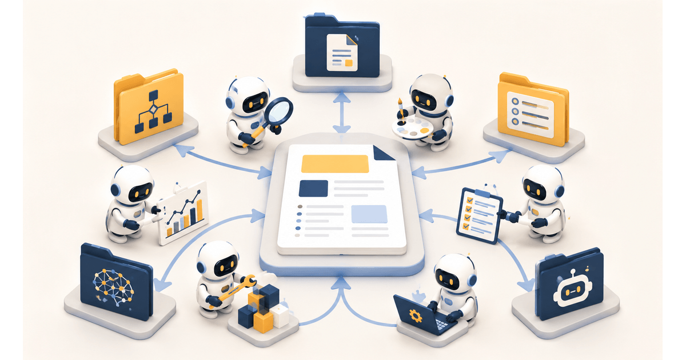

# Vibe Coding 升级教学：2026 Agentic Engineering 六阶段实战 SOP（含范本与案例）

> 原文：https://israynotarray.com/ai/20260517/3851629074/
> 作者：是 Ray 不是 Array
> 日期：2026-05-17
> 标签：#AI #Claude Code #AGENTS.md #Vibe Coding #Agentic Engineering #AI 开发流程 #Sub-agent #Spec-Driven Development #Plan Mode



---

## 前言

如果你有用过 Claude Code、Cursor、Codex 这类 AI Coding 工具，应该都遇过类似的瓶颈：刚上手觉得超神奇，可是真的拿来开发一个有规模的专案，各种雷就跑出来 — context 爆掉之后 AI 忘光、改 A 坏 B 改了又改、AI 改着改着把好的 code 也盖掉、好几个档案一起被改没办法回滚等等。

**这些都不是工具的问题，是跟 AI 协作的流程没建立起来。**

说到这边有件事满值得提一下，Andrej Karpathy 是 2025 年 2 月（原始 tweet）提出 Vibe Coding 这个词的人，到了 2026 年 4 月他自己在 Sequoia Ascent 2026 的演讲（标题「Software 3.0, Agentic Engineering, and Jagged Intelligence」）上直接升级了这个概念，提出 **Agentic Engineering（代理工程）**。演讲里关键的一句话是：

> 「Vibe coding raises the floor. Agentic engineering is about extrapolating the ceiling.」

翻成白话就是：Vibe coding 是抬升底线，让没写过 code 的人也能做出东西；Agentic engineering 是抬升天花板，是专业工程师该有的工作方式。

那 agentic engineer 跟以前的 vibe coder 差在哪？根据演讲的核心讯息，重点不再是描述需求让 AI 写然后直接 ship，而是 **AI 扮演实作者、你扮演监督者**，要做的几件事大致包含：设计规格、监督计划、检查 diff、写测试、建立评估循环、管理权限、隔离 worktree、维持品质。换句话说，agentic engineer 不会盲目接受 AI 生成的 code，而是用工程纪律包住 AI 速度。

---

## 六阶段实战 SOP

下面这套六阶段 SOP 是我自己实作下来觉得最稳的流程：

### 阶段零 — 写 CLAUDE.md（专案宪法）

在写任何 code 之前，第一件要做的事是写 `CLAUDE.md`（或 `AGENTS.md`），这是专案给 AI 看的宪法。它让 AI 在一开始就理解：
- 专案目标
- Tech Stack
- Code Style
- 测试要求
- 开发流程

### 阶段一 — Spec-Driven Development（规约驱动开发）

**不要直接问 AI「帮我写一个购物车」，先写规格。**

规格要包含：
1. 功能描述
2. 输入输出
3. 边界情况
4. 错误处理

### 阶段二 — Plan Mode（计划模式）

让 AI 先产生执行计划，你审核通过后再让它动手。

Plan 要包含：
1. 要改哪些档案
2. 每个档案的改动内容
3. 风险分析
4. 测试策略

### 阶段三 — 执行与 Diff Review

AI 执行完计划后，**每一行 diff 都要 review**。

重点检查：
1. 改 A 有没有坏 B
2. 有没有多余的改动
3. 有没有安全隐患
4. 测试有没有补上

### 阶段四 — 写测试

- 纯函数 100% 覆盖
- API composable 至少测 happy path + 1 个 error case
- 同一轮补测试，不可延后

### 阶段五 — 建立评估循环

用评估（Evaluation）来量化品质，而不是凭感觉。

评估维度：
1. 正确性
2. 完整性
3. 安全性
4. 效能

---

## 实战案例：小型电商 MVP

用一个「个人卖自制商品的小型电商 MVP」来示范这套流程。

**Tech Stack**：Supabase（DB + Auth）+ Stripe（付款）+ Vercel（hosting）

### Step 1 — 写 CLAUDE.md（搭配 AGENTS.md）当专案宪法

```markdown
# RaySelf Shop - Claude Code Instructions

@AGENTS.md

## 开工前必读
@docs/ROADMAP.md
@docs/tasks.md

## Project Overview
个人卖自制商品的小型电商 MVP，目标 1 个月内上线收得到钱。

## Tech Stack
- Frontend: Nuxt 3, Vue 3, Tailwind, Pinia
- Backend: Supabase（PostgreSQL + Auth + Storage）
- Payment: Stripe Checkout（Redirect 模式）
- Hosting: Vercel
- Package Manager: pnpm

## Build & Test
- 安装：pnpm install
- 开发：pnpm dev
- 测试：pnpm test
- 型别检查：pnpm typecheck
- 打包：pnpm build

## Code Style
- Vue 3 Composition API + script setup
- composable 用 useXxx 命名（useCart、useProducts、useCheckout）
- API 呼叫抽到 composables/api/*.ts
- 纯函数（价格计算、运费计算）抽到 utils/
- server route 放 server/api/

## Testing Rules
- 纯函数（价格计算、运费、税金、折扣）100% 覆盖
- API composable 至少测 happy path + 1 个 error case
- 同一轮补测试，不可延后

## Git Workflow
- commit message 用 Conventional Commits
- 一个逻辑改动一个 commit
```

### Step 2 — 写 Spec（规格）

**核心功能清单：**

1. 商品列表（分页 + 分类）
2. 商品详情
3. 购物车（CRUD）
4. 结账流程（Stripe Checkout）
5. 订单查询
6. 会员注册/登入

**以购物车为例的 Spec：**

```
## 功能：加入购物车

### Input
- product_id: string（必填）
- quantity: number（必填，>= 1）

### Output
- cart_id: string
- items: CartItem[]
- total: number

### 边界情况
- 商品不存在 → 回传 404
- 库存不足 → 回传 409 + 可用库存数
- 重复加入 → 数量累加

### Error
- 未登入 → 回传 401
- product_id 格式错误 → 回传 400
```

### Step 3 — Plan Mode + 执行

让 AI 根据 Spec 产生执行计划，分轮执行：

**Round 1：DB Schema + 型别定义**
```
- packages: id, name, description, price, images, stock, created_at
- carts: id, user_id, created_at, updated_at
- cart_items: id, cart_id, product_id, quantity
- orders: id, user_id, total, status, stripe_session_id, created_at
- order_items: id, order_id, product_id, quantity, price
```

**Round 2：API Route + Composable**
- server/api/products/index.get.ts
- server/api/cart/index.get.ts
- server/api/cart/index.post.ts
- composables/api/useProducts.ts
- composables/api/useCart.ts

**Round 3：页面 + Component**
- pages/index.vue（商品列表）
- pages/products/[id].vue（商品详情）
- pages/cart.vue（购物车）
- components/cart/ProductCard.vue
- components/cart/CartItem.vue

### Step 4 — Stripe 整合

Stripe Checkout 的流程：

1. 前端 POST `/api/create-checkout-session`
2. 后端建立 Stripe Checkout Session，回传 URL
3. 前端 redirect 到 Stripe
4. Stripe webhook `checkout.session.completed` 回调更新订单状态
5. 前端用 `onSuccessfulCheckout` hook 清除购物车

**CRITICAL RULE for AI（用 CLAUDE.md 守住底线）：**

```
## CRITICAL RULES（不可违反）
1. 付款金额必须从 Server 计算，不可相信 Client 传来的金额
2. Stock 扣减必须在 Webhook 内用 transaction 执行，不可在其他地方扣
3. 所有 Stripe Webhook 都要验证 Signature
4. Stripe Secret Key 只存在 Server 端 .env，不可让 Client 读到
```

---

## 六阶段 SOP 对照总结

| 阶段 | 核心动作 | 产出 |
|------|---------|------|
| 0 — 专案宪法 | 写 CLAUDE.md / AGENTS.md | AI 行为规范文件 |
| 1 — Spec | 写功能规格 | 功能清单 + 边界情况 + 错误处理 |
| 2 — Plan | 让 AI 产生执行计划 | 档案清单 + 改动内容 + 风险分析 |
| 3 — 执行 + Diff Review | AI 写 code，你 review diff | 干净的 code change |
| 4 — 补测试 | 纯函数 100%，API 至少 2 case | 测试覆盖 |
| 5 — 评估循环 | 量化品质指标 | 评估报告 |

---

## 关键 Takeaways

1. **Agentic Engineering 是 Vibe Coding 的升级版** — 从「描述就 ship」变成「你设计、AI 实作、你监督」
2. **CLAUDE.md / AGENTS.md 是专案宪法** — 写 code 之前先写这份文件，让 AI 从第一分钟就知道你的规矩
3. **Spec-Driven Development** — 先写规格再写 code，大幅降低 AI 产生无用 code 的机率
4. **Plan Mode** — 让 AI 先产生计划，你 review 过再执行
5. **Vibe Coding 靠感觉，Agentic Engineering 靠纪律** — 规约、计划、review、测试、评估，缺一不可

---

*本文由「是 Ray 不是 Array」撰写，原文：[Vibe Coding 升级教学：2026 Agentic Engineering 六阶段实战 SOP（含范本与案例）](https://israynotarray.com/ai/20260517/3851629074/)*