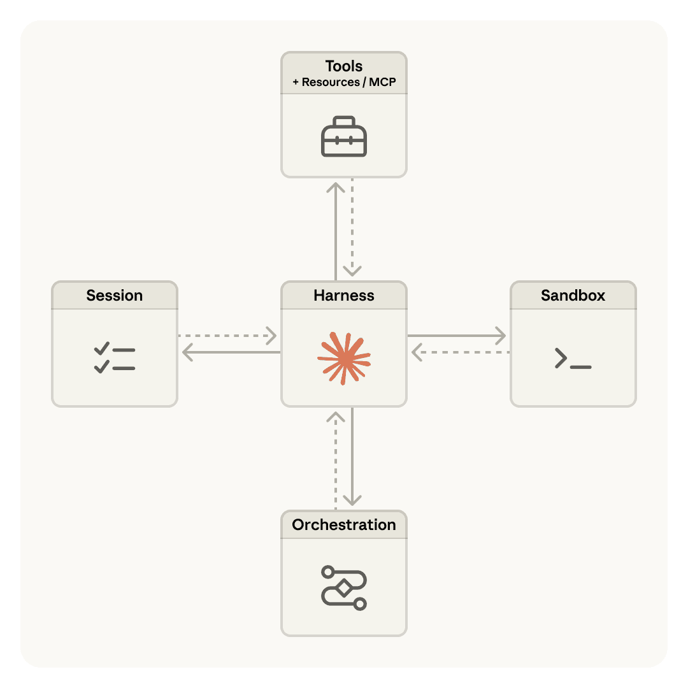
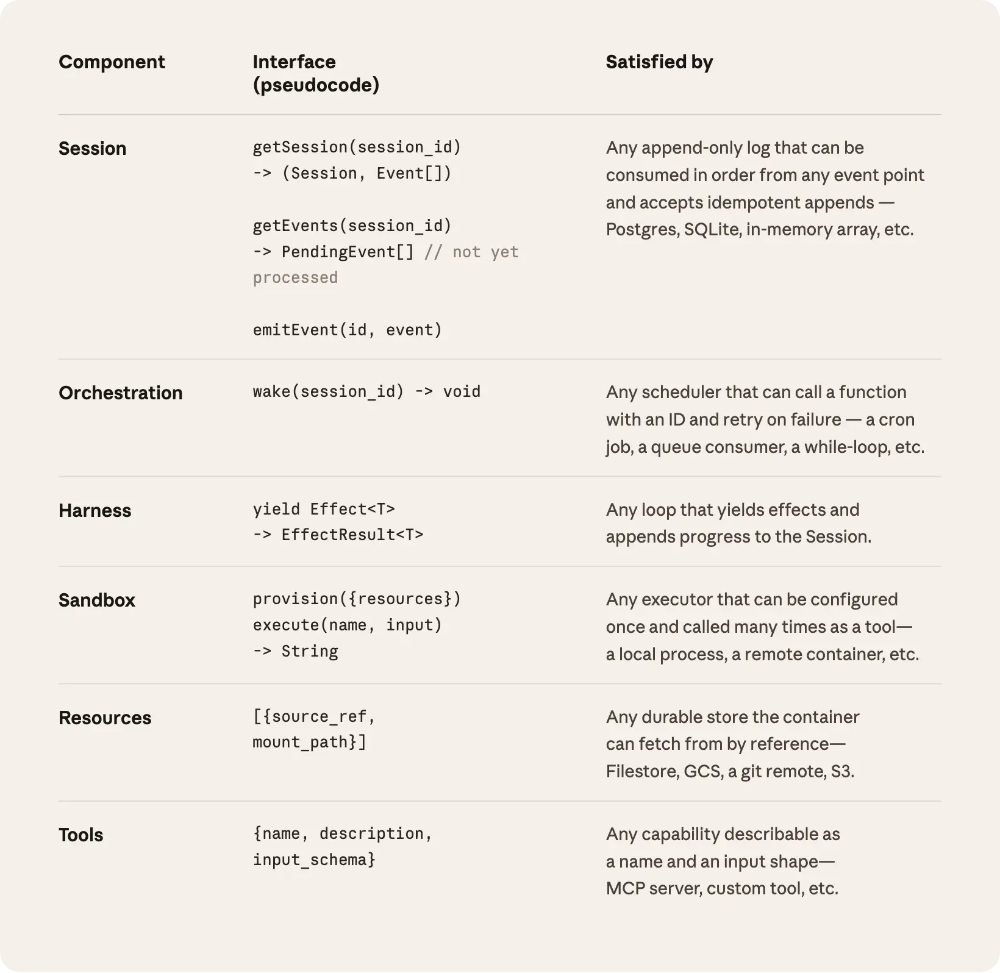
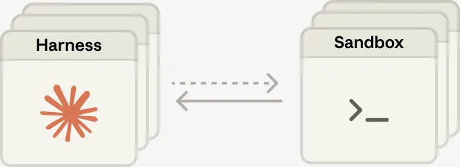

# Scaling Managed Agents: Decoupling the brain from the hands

**Source**: https://www.anthropic.com/engineering/managed-agents  
**Published**: Apr 08, 2026  
**Authors**: Lance Martin, Gabe Cemaj, and Michael Cohen

---

Harnesses encode assumptions that go stale as models improve. Managed Agents—our hosted service for long-horizon agent work—is built around interfaces that stay stable as harnesses change.

---

## Introduction

A running topic on the Engineering Blog is how to build effective agents and design harnesses for long-running work. A common thread across this work is that harnesses encode assumptions about what Claude can't do on its own. However, those assumptions need to be frequently questioned because they can go stale as models improve.

As just one example, in prior work we found that Claude Sonnet 4.5 would wrap up tasks prematurely as it sensed its context limit approaching—a behavior sometimes called "context anxiety." We addressed this by adding context resets to the harness. But when we used the same harness on Claude Opus 4.5, we found that the behavior was gone. The resets had become dead weight.

We expect harnesses to continue evolving. So we built Managed Agents: a hosted service in the Claude Platform that runs long-horizon agents on your behalf through a small set of interfaces meant to outlast any particular implementation—including the ones we run today.

---

## The OS Analogy: Designing for "programs as yet unthought of"

Building Managed Agents meant solving an old problem in computing: how to design a system for "programs as yet unthought of." Decades ago, operating systems solved this problem by virtualizing hardware into abstractions—process, file—general enough for programs that didn't exist yet. The abstractions outlasted the hardware. The `read()` command is agnostic as to whether it's accessing a disk pack from the 1970s or a modern SSD. The abstractions on top stayed stable while the implementations underneath changed freely.

Managed Agents follow the same pattern. We virtualized the components of an agent:

| Component | Role |
|-----------|------|
| **Session** | The append-only log of everything that happened |
| **Harness** | The loop that calls Claude and routes Claude's tool calls to the relevant infrastructure |
| **Sandbox** | An execution environment where Claude can run code and edit files |

This allows the implementation of each to be swapped without disturbing the others. We're opinionated about the shape of these interfaces, not about what runs behind them.

---

## Don't adopt a pet

We started by placing all agent components into a single container, which meant the session, agent harness, and sandbox all shared an environment. There were benefits to this approach, including that file edits are direct syscalls, and there were no service boundaries to design.

But by coupling everything into one container, we ran into an old infrastructure problem: we'd adopted a **pet**. In the pets-vs-cattle analogy, a pet is a named, hand-tended individual you can't afford to lose, while cattle are interchangeable. In our case, the server became that pet; if a container failed, the session was lost. If a container was unresponsive, we had to nurse it back to health.

### Problems with the coupled design

| Problem | Description |
|---------|-------------|
| **Debugging stuck sessions** | The WebSocket event stream couldn't tell us where failures arose. A bug in the harness, a packet drop, or a container going offline all presented the same. |
| **Security boundary** | Untrusted code ran in the same container as credentials—a prompt injection only had to convince Claude to read its own environment. |
| **Network peering** | Customers had to peer their network with ours to connect Claude to their VPC, or run our harness in their own environment. |

---

## Decouple the brain from the hands

The solution was to decouple what we thought of as the **"brain"** (Claude and its harness) from both the **"hands"** (sandboxes and tools that perform actions) and the **"session"** (the log of session events).

### Key interfaces

| Interface | Function | Purpose |
|-----------|----------|---------|
| `execute(name, input) → string` | Tool call to sandbox | Brain calls hands like any other tool |
| `wake(sessionId)` | Restart harness | Harness becomes cattle |
| `getSession(id)` | Retrieve event log | Session sits outside harness |
| `emitEvent(id, event)` | Write to session | Durable record during agent loop |
| `provision({resources})` | Create sandbox | Standard recipe for reinitializing containers |
| `getEvents()` | Read session events | Context object outside Claude's context window |

### The harness leaves the container

The harness no longer lived inside the container. It called the container the way it calls any other tool: `execute(name, input) → string`. The container became **cattle**. If the container died, the harness caught the failure as a tool-call error and passed it back to Claude. If Claude decided to retry, a new container could be reinitialized with a standard recipe: `provision({resources})`. We no longer had to nurse failed containers back to health.

### Recovering from harness failure

The harness also became cattle. Because the session log sits outside the harness, nothing in the harness needs to survive a crash. When one fails, a new one can be rebooted with `wake(sessionId)`, use `getSession(id)` to get back the event log, and resume from the last event.

### The security boundary

In the coupled design, any untrusted code that Claude generated was run in the same container as credentials—so a prompt injection only had to convince Claude to read its own environment. Once an attacker has those tokens, they can spawn fresh, unrestricted sessions and delegate work to them.

The structural fix was to make sure the tokens are never reachable from the sandbox where Claude's generated code runs.

| Pattern | Implementation |
|---------|----------------|
| **Auth bundled with resource** | Git: access token used to clone repo during sandbox initialization, wired into local git remote. Push/pull work without agent handling token. |
| **Auth in vault** | MCP tools: OAuth tokens stored in secure vault. Claude calls MCP tools via dedicated proxy that fetches credentials from vault. |

---

## The session is not Claude's context window

Long-horizon tasks often exceed the length of Claude's context window, and the standard ways to address this all involve irreversible decisions about what to keep:

| Technique | Description |
|-----------|-------------|
| **Compaction** | Claude saves a summary of its context window |
| **Memory tool** | Claude writes context to files |
| **Context trimming** | Selectively removes tokens (old tool results, thinking blocks) |

But irreversible decisions to selectively retain or discard context can lead to failures. It is difficult to know which tokens the future turns will need.

In Managed Agents, the session provides a context object that lives outside Claude's context window. The interface `getEvents()` allows the brain to interrogate context by selecting positional slices of the event stream:

- Pick up from wherever it last stopped reading
- Rewind a few events before a specific moment
- Reread context before a specific action

We separated the concerns of **recoverable context storage** (session) and **arbitrary context management** (harness) because we can't predict what specific context engineering will be required in future models.

---

## Many brains, many hands

### Many brains

Decoupling the brain from the hands solved one of our earliest customer complaints. When teams wanted Claude to work against resources in their own VPC, the only path was to peer their network with ours.

**Performance payoff**: When we initially put the brain in a container, it meant many brains required as many containers. Every session paid the full container setup cost up front—even ones that would never touch the sandbox.

**Time-to-first-token (TTFT)** measures how long a session waits between accepting work and producing its first response token. This is the latency the user most acutely feels.

| Metric | Improvement |
|--------|-------------|
| **p50 TTFT** | Dropped ~60% |
| **p95 TTFT** | Dropped ~90% |

Decoupling means containers are provisioned by the brain via a tool call only if needed. Inference could start as soon as the orchestration layer pulled pending events from the session log.

### Many hands

We also wanted the ability to connect each brain to many hands. In practice, this means Claude must reason about many execution environments and decide where to send work—a harder cognitive task than operating in a single shell.

As intelligence scaled, the single container became the limitation: when that container failed, we lost state for every hand that the brain was reaching into.

Decoupling makes each hand a tool: `execute(name, input) → string`. That interface supports:

- Any custom tool
- Any MCP server
- Our own tools

The harness doesn't know whether the sandbox is a container, a phone, or a Pokémon emulator. And because no hand is coupled to any brain, **brains can pass hands to one another**.

---

## Conclusion

The challenge we faced is an old one: how to design a system for "programs as yet unthought of." Operating systems have lasted decades by virtualizing the hardware into abstractions general enough for programs that didn't exist yet.

Managed Agents is a **meta-harness** in the same spirit, unopinionated about the specific harness that Claude will need in the future. Rather, it is a system with general interfaces that allow many different harnesses.

**Meta-harness design means being opinionated about the interfaces around Claude**:

- Claude will need the ability to manipulate state (the session)
- Claude will need the ability to perform computation (the sandbox)
- Claude will require the ability to scale to many brains and many hands

We designed the interfaces so that these can be run reliably and securely over long time horizons. But we make no assumptions about the number or location of brains or hands that Claude will need.