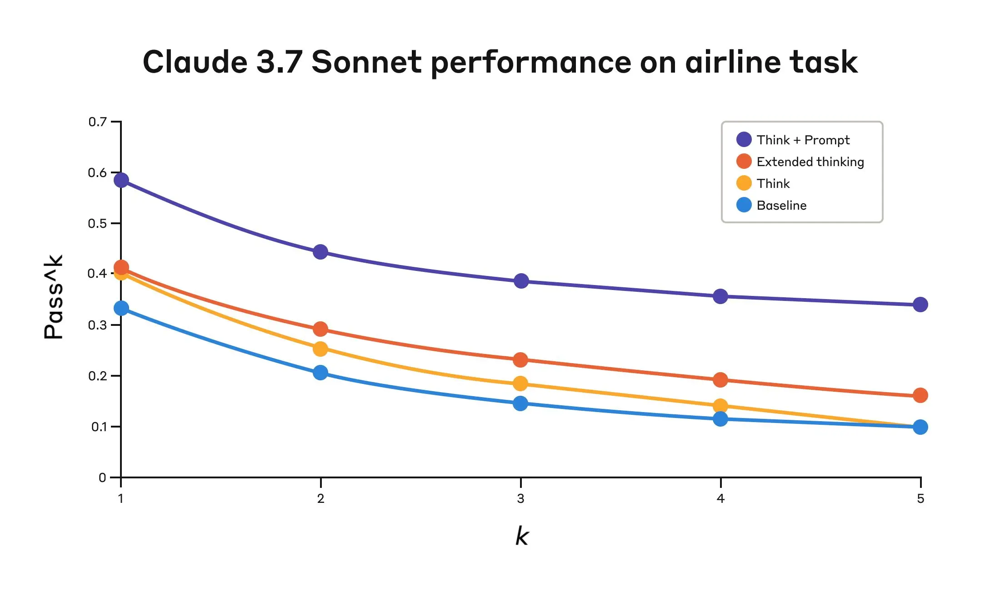

# "think" 工具：让 Claude 在复杂工具使用场景中停下来思考

**来源**: https://www.anthropic.com/engineering/claude-think-tool  
**发布日期**: 2025年3月20日  
**更新**: 2025年12月15日（Extended thinking 更新）

---

> **Extended Thinking 更新（2025年12月15日）**：Extended thinking 功能自初始发布以来已显著改进，我们推荐在大多数情况下使用该功能而非专用的 think 工具。Extended thinking 提供类似的好处——给 Claude 空间推理复杂问题——并有更好的集成和性能。详见 extended thinking 文档。

---

随着我们持续增强 Claude 的复杂问题解决能力，我们发现了一个特别有效的方法：**"think" 工具**——在复杂任务中创建专用空间进行结构化思考。

这个简单而强大的技术（与 Claude 新的 "extended thinking" 能力不同）显著提升了 Claude 的智能体工具使用能力，包括遵循策略、做出一致决策和处理多步骤问题，且实现开销极小。

---

## 什么是 "think" 工具？

通过 "think" 工具，我们让 Claude 在得出最终答案的过程中增加一个额外的思考步骤——拥有自己的专用空间。

### 与 Extended Thinking 的区别

| 特性 | Extended Thinking | "think" 工具 |
|------|-------------------|--------------|
| **时机** | 生成响应之前 | 响应生成过程中 |
| **目的** | 行动前深度考虑并迭代计划 | 停下来思考是否有足够信息继续前进 |
| **用例** | 从用户查询中获取所有信息 | 需处理外部信息（工具调用结果） |
| **深度** | 全面推理 | 聚焦于发现的新信息 |

### 各适用场景

| 场景 | 推荐 |
|------|------|
| 非顺序工具调用 | Extended thinking |
| 简单指令遵循 | Extended thinking |
| 编码、数学、物理（无工具） | Extended thinking |
| **复杂工具调用** | "think" 工具 |
| **长工具调用链** | "think" 工具 |
| **策略密集环境** | "think" 工具 |
| **错误代价高的顺序决策** | "think" 工具 |

---

## 工具定义

来自 τ-Bench 的标准工具规范示例：

```json
{
  "name": "think",
  "description": "Use the tool to think about something. It will not obtain new information or change the database, but just append the thought to the log. Use it when complex reasoning or some cache memory is needed.",
  "input_schema": {
    "type": "object",
    "properties": {
      "thought": {
        "type": "string",
        "description": "A thought to think about."
      }
    },
    "required": ["thought"]
  }
}
```

---

## τ-Bench 性能表现



τ-bench（tau-bench）是一个综合基准测试，用于测试模型在真实客服场景中使用工具的能力。

**评估指标**：`pass^k` 测量所有 k 个独立任务试验都成功的概率。与 `pass@k`（至少一个成功）不同，`pass^k` 评估**一致性和可靠性**——这对客服场景至关重要，因为一致的策略遵循是关键。

### 测试配置

1. 基线（无 "think" 工具，无 extended thinking）
2. Extended thinking 单独
3. "think" 工具单独
4. "think" 工具 + 优化提示词

### 结果 - Airline 域

| 配置 | k=1 | k=2 | k=3 | k=4 | k=5 |
|------|-----|-----|-----|-----|-----|
| **"Think" + Prompt** | 0.584 | 0.444 | 0.384 | 0.356 | 0.340 |
| "Think" | 0.404 | 0.254 | 0.186 | 0.140 | 0.100 |
| Extended thinking | 0.412 | 0.290 | 0.232 | 0.192 | 0.160 |
| Baseline | 0.332 | 0.206 | 0.148 | 0.116 | 0.100 |

**关键发现**：
- "Think" + 优化提示词：相比基线 **54% 相对提升**（pass^1 从 0.370 提升至 0.570）
- Extended thinking 表现与未提示的 "think" 工具相似


### 结果 - Retail 域

| 配置 | k=1 | k=2 | k=3 | k=4 | k=5 |
|------|-----|-----|-----|-----|-----|
| **"Think" + no prompt** | 0.812 | 0.735 | 0.685 | 0.650 | 0.626 |
| Extended thinking | 0.770 | 0.681 | 0.623 | 0.581 | 0.548 |
| Baseline | 0.783 | 0.695 | 0.643 | 0.607 | 0.583 |

**关键发现**：
- Retail 策略较简单 → "Think" 工具单独即达最高 pass^1（0.812）
- 简单域无需额外提示

---

## 优化提示词示例

Airline 域最佳表现来自 "think" 工具配合优化提示词：

```
## 使用 think 工具

在收到工具结果后采取任何行动或响应用户之前，使用 think 工具作为草稿板：
- 列出适用于当前请求的具体规则
- 检查是否已收集所有必要信息
- 验证计划行动是否符合所有策略
- 遍历工具结果确保正确性

以下是在 think 工具内遍历的示例：
<think_tool_example_1>
用户想取消航班 ABC123
- 需验证：用户ID、预订ID、原因
- 检查取消规则：
  * 是否在预订后24小时内？
  * 如不是，检查票类和保险
- 验证无已飞段或过去的段
- 计划：收集缺失信息、验证规则、获取确认
</think_tool_example_1>

<think_tool_example_2>
用户想预订3张去NYC的票，每人2件托运行李
- 需用户ID检查：
  * 会员等级决定行李额度
  * 账户中有哪些支付方式
- 行李计算：
  * 经济舱 × 3乘客
  * 普通会员：1件免费行李 → 3件额外 = $150
  * 银卡会员：2件免费行李 → 0件额外 = $0
  * 金卡会员：3件免费行李 → 0件额外 = $0
- 支付规则验证：
  * 最多1张旅行券、1张信用卡、3张礼品卡
  * 所有支付方式必须在账户中
  * 旅行券余额浪费
- 计划：
1. 获取用户ID
2. 验证会员等级确定行李费用
3. 检查账户支付方式及其组合是否允许
4. 计算总价：票价 + 行李费用
5. 获取明确预订确认
</think_tool_example_2>
```

---

## SWE-Bench 性能

类似的 "think" 工具被添加到 SWE-bench 测试中，Claude 3.7 Sonnet 取得 **0.623** 的最佳成绩。

**适配的工具定义**：

```json
{
  "name": "think",
  "description": "Use the tool to think about something. It will not obtain new information or make any changes to the repository, but just log the thought. Use it when complex reasoning or brainstorming is needed. For example, if you explore the repo and discover the source of a bug, call this tool to brainstorm several unique ways of fixing the bug, and assess which change(s) are likely to be simplest and most effective.",
  "input_schema": {
    "type": "object",
    "properties": {
      "thought": {
        "type": "string",
        "description": "Your thoughts."
      }
    },
    "required": ["thought"]
  }
}
```

**结果**：n=30 样本（有 "think"）vs n=144 样本（无）→ **+1.6% 提升**（Welch's t-test: p < .001）

---

## 何时使用 "think" 工具

| 场景 | 收益 |
|------|------|
| **工具输出分析** | 处理前序工具调用输出后再行动；可能需要回溯 |
| **策略密集环境** | 遵循详细指南并验证合规性 |
| **顺序决策** | 每步行动建立在前序之上；错误代价高 |

---

## 实现最佳实践

### 1. 领域特定示例的策略性提示

提供关于何时何地使用 "think" 工具的明确指令：
- 推理过程期望的细节程度
- 如何将复杂指令拆解为可执行步骤
- 处理常见场景的决策树
- 如何检查是否已收集所有必要信息

### 2. 将复杂指导放在系统提示词中

当指令长/复杂时，放在**系统提示词**而非工具描述中。这提供更广上下文，帮助模型更好集成思考过程。

---

## 何时不使用 "think" 工具

| 场景 | 原因 |
|------|------|
| 非顺序工具调用 | 单次或并行调用不受益 |
| 简单指令遵循 | 默认行为足够 |
| 成本考虑 | 增加提示词长度和输出 token |

---

## 快速上手

1. **在智能体工具使用场景测试** — 从 Claude 在策略合规或复杂推理上挣扎的挑战用例开始
2. **添加工具定义** — 针对你的领域定制；考虑在系统提示词中加入带示例的指令
3. **监控和调优** — 观察 Claude 如何使用工具；调整提示词以鼓励有效思考模式

**最小副作用**：除非 Claude 决定使用，不会改变外部行为；不干扰现有工具或工作流。

---

## 关键洞察

| 洞察 | 细节 |
|------|------|
| **困难领域提示词重要** | "Think" 单独有改善；+优化提示词 = 显著更好 |
| **简单领域提示词需求少** | Retail："Think" 单独即达最佳 |
| **一致性提升** | 改善在 pass^k 直到 k=5 都保持 |
| **跨模型泛化** | Claude 3.5 Sonnet (New) 同配置也获益 |