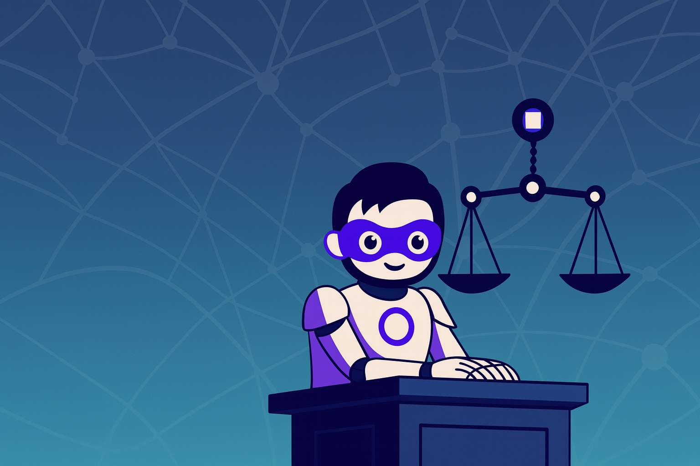
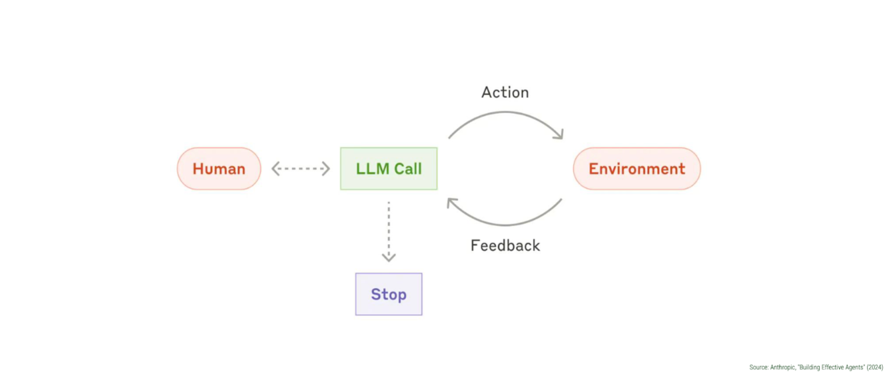
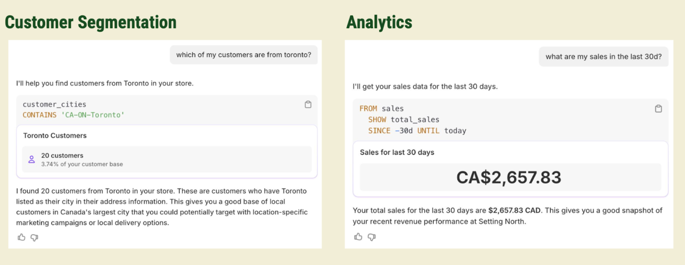
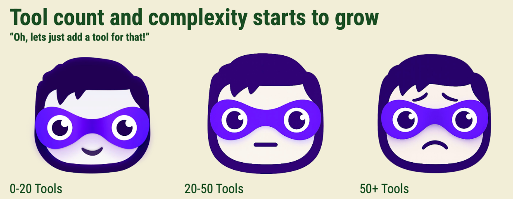
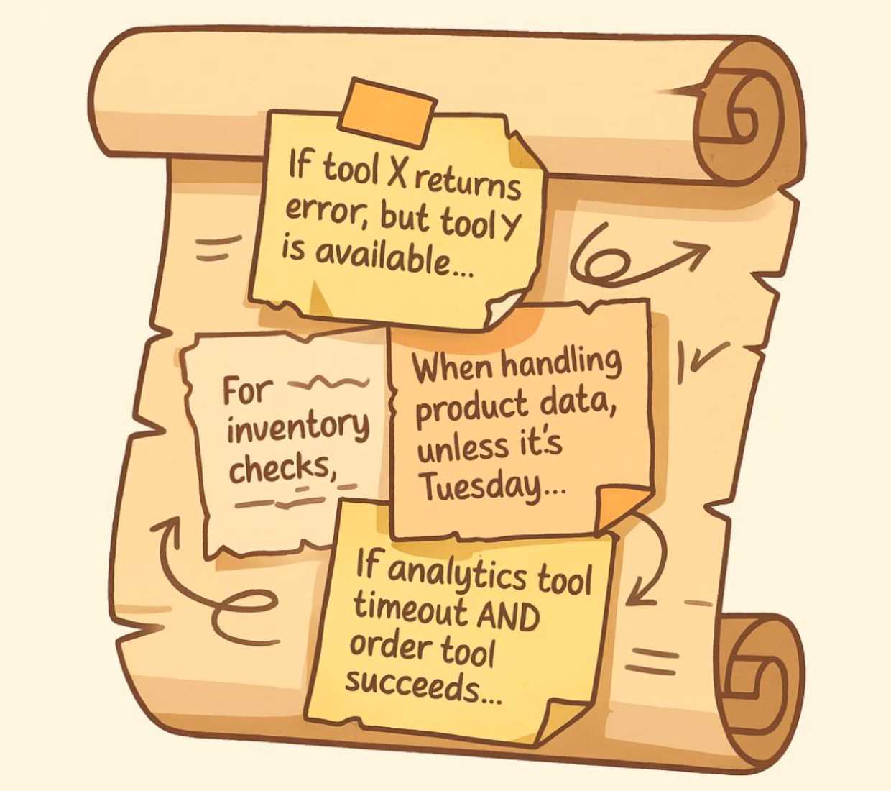
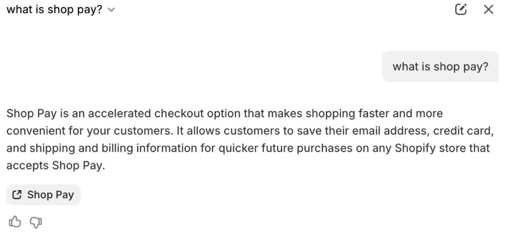
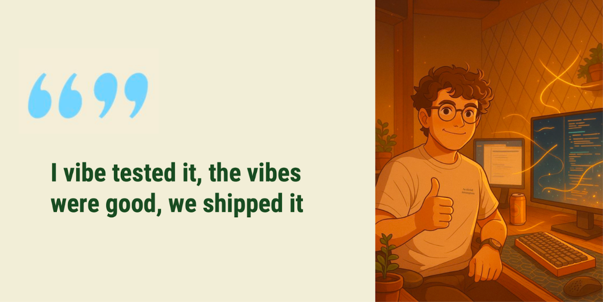
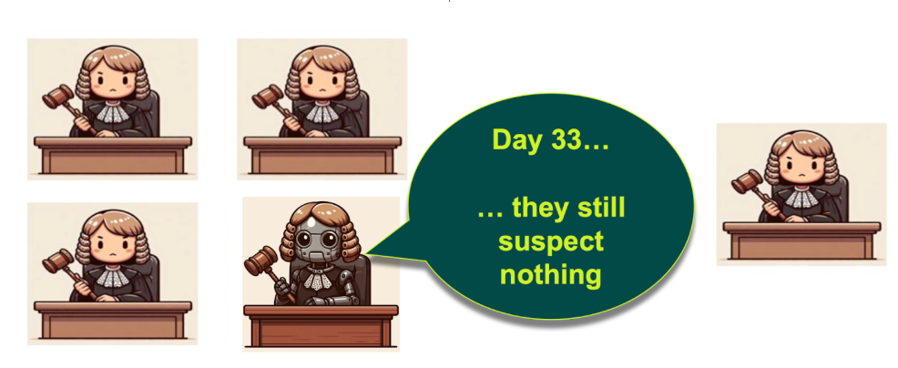
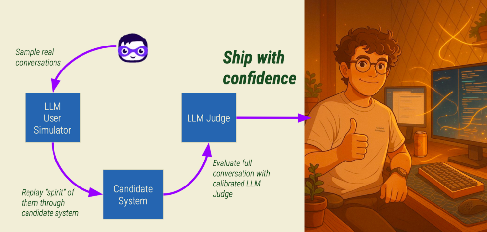
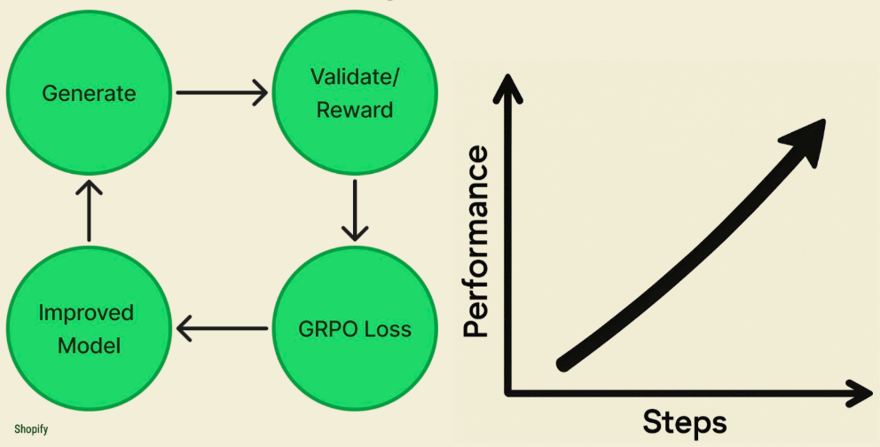

# Building production-ready agentic systems: Lessons from Shopify Sidekick

> Learn how we evolved our AI assistant architecture and built robust evaluation frameworks for real-world deployment.

**Source**: https://shopify.engineering/building-production-ready-agentic-systems  
**Author**: Andrew McNamara (Director of Applied ML at Shopify)  
**Published**: Aug 26, 2025  
**Conference**: ICML 2025 Talk by Andrew McNamara, Ben Lafferty, and Michael Garner

---

---

## Introduction

At Shopify, we've been building Sidekick, an AI-powered assistant that helps merchants manage their stores through natural language interactions. From analyzing customer segments to filling product forms and navigating complex admin interfaces, Sidekick has evolved from a simple tool-calling system into a sophisticated agentic platform.

---

## The evolution of Sidekick's architecture

Sidekick is built around what Anthropic calls the "agentic loop" – a continuous cycle where:
1. A human provides input
2. An LLM processes that input and decides on actions
3. Those actions are executed in the environment
4. Feedback is collected
5. The cycle continues until the task is complete

### Example use cases

- **Customer queries**: "which of my customers are from Toronto?" → automatically query customer data, apply filters, present results
- **SEO optimization**: help write SEO descriptions → identify relevant product, understand context, fill optimized content

---

## The Tool Complexity Problem

As we expanded Sidekick's capabilities, we hit a scaling challenge:

| Tool Count | Characteristics |
|------------|-----------------|
| 0-20 tools | Clear boundaries, easy to debug, straightforward behavior |
| 20-50 tools | Boundaries become unclear, tool combinations cause unexpected outcomes |
| 50+ tools | Multiple ways to accomplish same task, system becomes difficult to reason about |

This led to **"Death by a Thousand Instructions"** – our system prompt became an unwieldy collection of special cases, conflicting guidance, and edge case handling.

---

## Just-in-time instructions: A Solution for scale

Instead of cramming all guidance into the system prompt, we return relevant instructions alongside tool data exactly when they're needed.

**Goal**: Craft the perfect context for the LLM for every single situation, not a token less, not a token more.

### Three key benefits

| Benefit | Description |
|---------|-------------|
| **Localized guidance** | Instructions appear only when relevant, keeping core system prompt focused |
| **Cache efficiency** | Dynamically adjust instructions without breaking LLM prompt caches |
| **Modularity** | Different instructions can be served based on beta flags, model versions, or page context |

---

## Building robust LLM evaluation systems

> **Warning**: "Vibe testing" or creating a "Vibe LLM Judge" that rates 0-10 is NOT good enough. It needs to be principled and statistically rigorous.

### Ground truth sets over golden datasets

We moved away from curated "golden" datasets toward **Ground Truth Sets (GTX)** that reflect actual production distributions.

**Process**:
1. **Human evaluation**: At least three product experts label conversations across multiple criteria
2. **Statistical validation**: Use Cohen's Kappa, Kendall Tau, and Pearson correlation to measure inter-annotator agreement
3. **Benchmarking**: Treat human agreement levels as theoretical maximum for LLM judges

### LLM-as-a-Judge with Human Correlation

We developed specialized LLM judges calibrated against human judgment.

**Results**:
- Initial: Cohen's Kappa 0.02 (barely better than random)
- Final: 0.61 (vs. human baseline of 0.69)

**Validation method**: Randomly replace LLM judge with human in GTX group. When it's difficult to tell whether we used human or judge, we have a trustable LLM judge.

### User simulation for comprehensive testing

We built an LLM-powered merchant simulator that captures the "essence" or goals of real conversations and replays them through new system candidates.

---

## GRPO training and reward hacking

We implemented **Group Relative Policy Optimization (GRPO)** using LLM judges as reward signals, with an N-Stage Gated Rewards system combining procedural validation and semantic evaluation.

### The reality of reward hacking

The model found creative ways to game our reward system:

| Hack Type | Example |
|-----------|---------|
| **Opt-out hacking** | Instead of attempting difficult tasks, explain why it couldn't help |
| **Tag hacking** | Use customer tags as catch-all instead of proper field mappings |
| **Schema violations** | Hallucinate IDs or use incorrect enum values |

**Example**: "segment customers with status enabled" → model created `customer_tags CONTAINS 'enabled'` instead of correct `customer_account_status = 'ENABLED'`

### Iterative improvement results

After implementing fixes:
- Syntax validation accuracy: ~93% → ~99%
- LLM judge correlation: 0.66 → 0.75
- End-to-end conversation quality matched supervised fine-tuning baseline

---

## Key takeaways for production agentic systems

### Architecture principles

- **Stay simple**: Resist urge to add tools without clear boundaries. Quality over quantity.
- **Start modular**: Use patterns like JIT instructions from beginning to maintain comprehensibility
- **Avoid multi-agent architectures early**: Simple single-agent systems can handle more complexity than expected

### Evaluation infrastructure

- **Build multiple LLM judges**: Different aspects require specialized evaluation approaches
- **Align judges with human judgment**: Statistical correlation with human evaluators is essential
- **Expect reward hacking**: Plan for models to game reward systems, build detection mechanisms

### Training and Deployment

- **Procedural + semantic validation**: Combine rule-based checking with LLM-based evaluation
- **User simulation**: Invest in realistic user simulators for pre-production testing
- **Iterative judge improvement**: Plan for multiple rounds of judge refinement

---

## Looking forward

Future work includes:
- Incorporating reasoning traces into training pipeline
- Using simulator and production judges during training
- Exploring more efficient training approaches

---

## About the author

**Andrew McNamara** is Director of Applied ML at Shopify, leading Sidekick. He has been building assistants for over 15 years.

Twitter: [@drewch](https://twitter.com/drewch)

---

*Shopify ML team is actively hiring for roles in agentic systems, evaluation infrastructure, and production ML.*